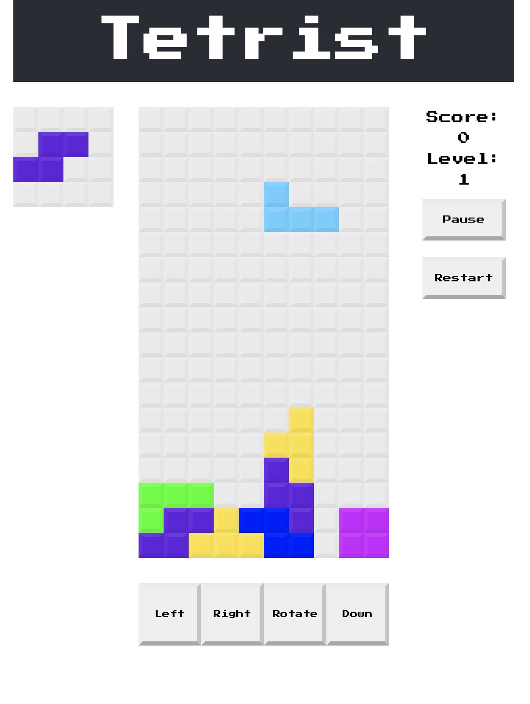
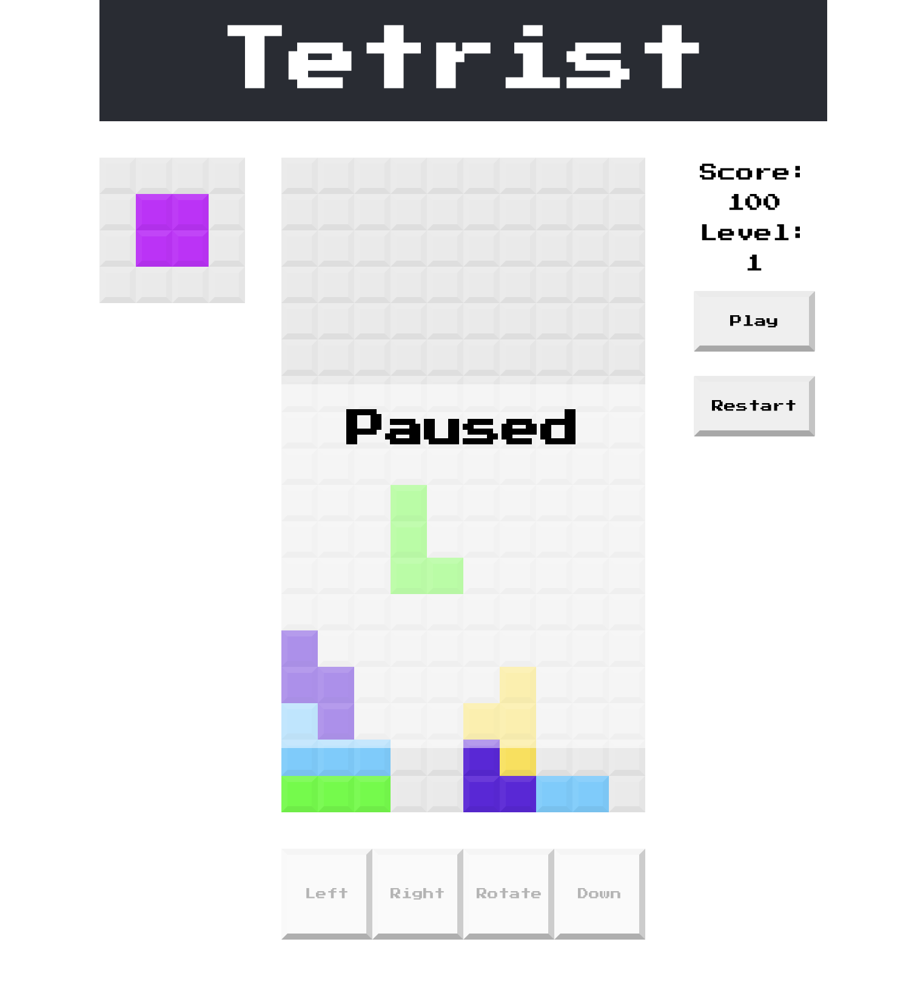
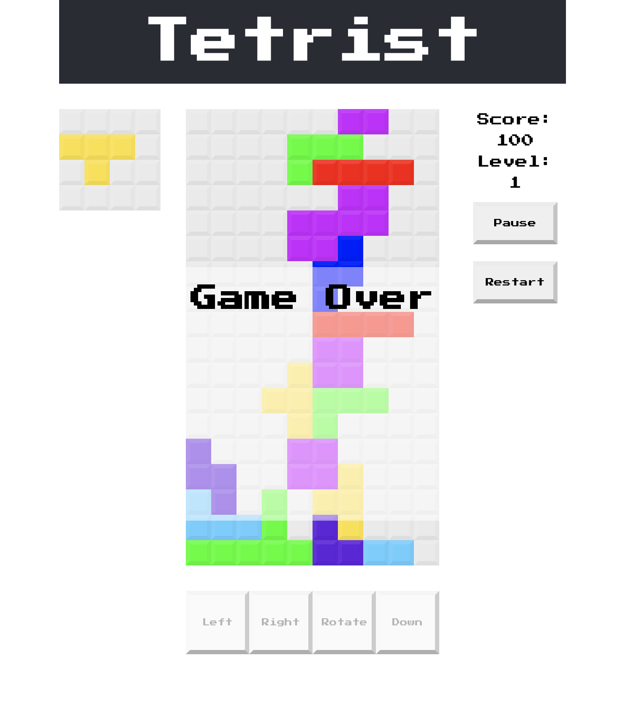

# Tetrist

This app is putting a fresh twist on the classic tetris game.

## [What is Tetris?](https://en.wikipedia.org/wiki/Tetris)

Initial app was made following this [tutorial](https://github.com/MakeSchool-Tutorials/web-7-react-redux-tetris-app) with approval from the creator.

 |  | 

Any contributions or suggestions are appreciated.

### Future roadmap ideas: 
* Just ran into new problem: game over happens if blocks are stacked halfway up the board? is it just too many blocks on the grid or...
* Problem: arrow keys can move blocks when game is paused
* Pause/resume should be tied to spacebar and possibly esc key
* make next block section have no background grid showing and make the block appear centered, maybe with an offset border
* for every 10 lines completed, level increases by 1. every level the current points add initial points to current points (lv 1 points for 3 lines = 300, lv 2 points for 3 lines = 600, lv 3 points for 3 lines = 900, 1200, etc.)
* make different display modes for the user to choose between (light mode, dark mode, different color palettes)
* add another facet to the game where blocks can fall off the sides, making it more strategic with needing to balance the blocks.